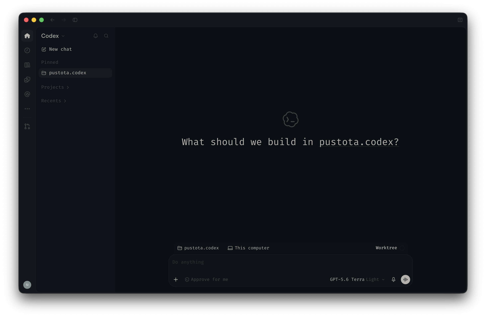
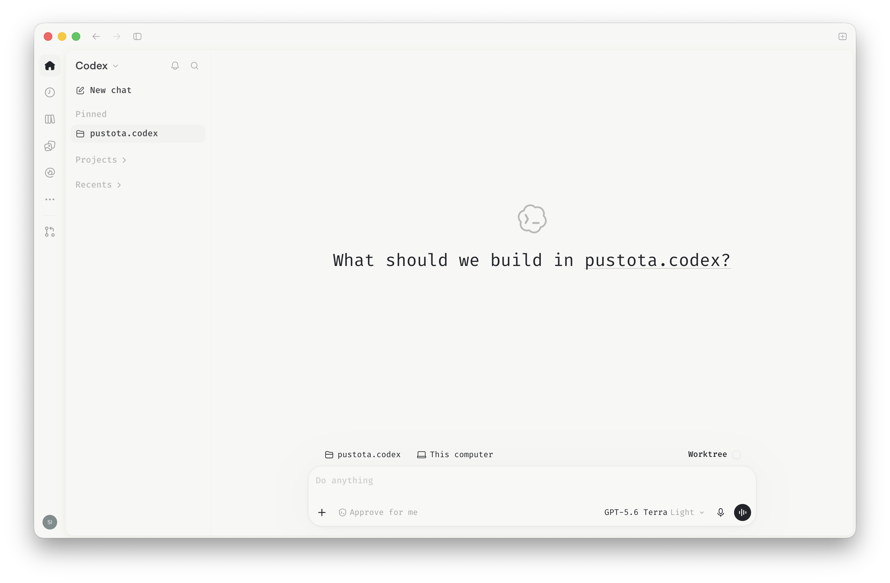

# Pustota for Codex

[Pustota](https://github.com/pustota-theme/pustota) adaptation for Codex.

  
  

## Install in Codex App

1. Open **Settings → Appearance**.
2. Choose **Import** in the matching theme section.
3. Copy the complete single line, including `codex-theme-v1:`, paste it, and confirm.

| Theme | Import payload |
| --- | --- |
| Dark | [`themes/dark`](./themes/dark) |
| Light | [`themes/light`](./themes/light) |

Each file is a ready-to-paste import payload.

## Font

The themes use **Fira Code** for both the interface and code. It is not bundled with Codex or guaranteed to be installed by the operating system. Install it from the [official Fira Code repository](https://github.com/tonsky/FiraCode) for the intended appearance. Without it, Codex uses a fallback font and the typography will differ.

## License

Distributed under the [MIT License](./LICENSE).
